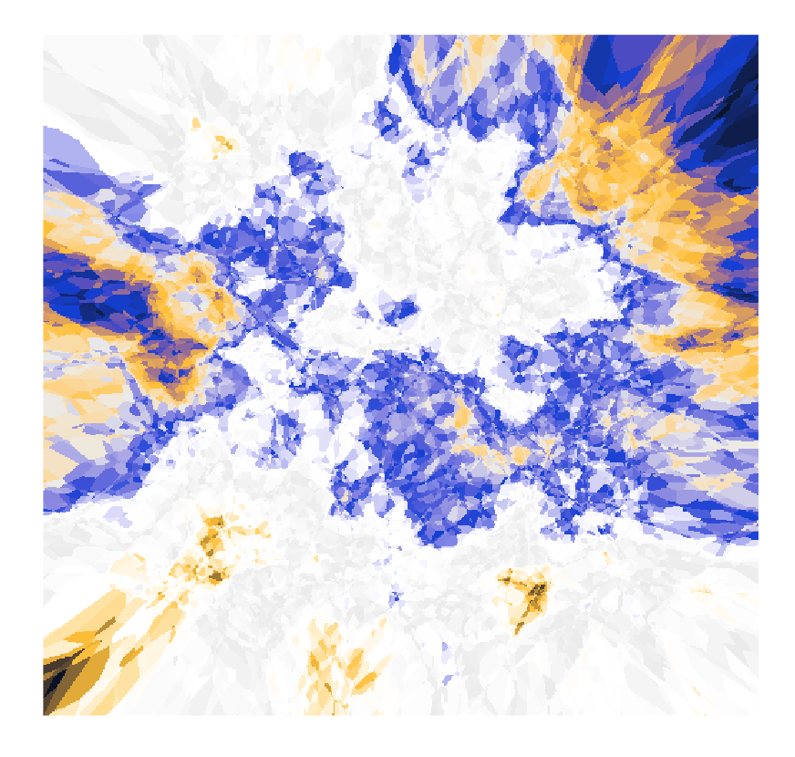

# Introduzione {.unnumbered}

{ width=40% }

In psicologia, nelle scienze sociali e in altre discipline è in corso una Riforma Metodologica, nata da una profonda crisi che ha colpito la scienza contemporanea: la Crisi di Replicazione dei risultati delle ricerche. Questa crisi mina la credibilità della ricerca scientifica e ha motivato una profonda revisione della metodologia alla base della ricerca psicologica e non solo. La crisi di replicazione ha molte cause: frode, pratiche di ricerca disoneste e incentivi distorti forniti dal sistema accademico. Una delle cause della crisi di replicazione è particolarmente rilevante per un corso sull'analisi dei dati psicologici: l'utilizzo delle tecniche inferenziali di stampo frequentista, che ha portato alla proliferazione di pubblicazioni contenenti falsi positivi.

In questa sezione della dispensa, metteremo in evidenza i limiti dell'inferenza frequentista, riconosciuti negli ultimi decenni come una delle principali cause della crisi della riproducibilità dei risultati della ricerca [@baker2016reproducibility]. Infine, discuteremo gli errori di tipo S e di tipo M, concetti introdotti da @gelman2014beyond, che hanno contribuito a migliorare la comprensione dei limiti della statistica frequentista.
